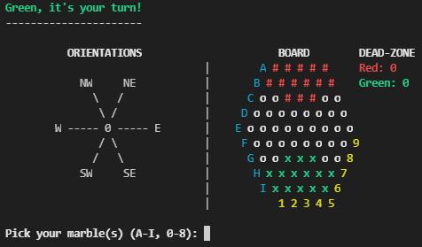

# Abalone
Abalone game (Michel Lalet and Laurent Lévi, 1989) in command line (player versus player).
\
Could be implemented:
- Displaying game rules
- Option to change the initial configuration
- Computer as opponent

Gameplay:

